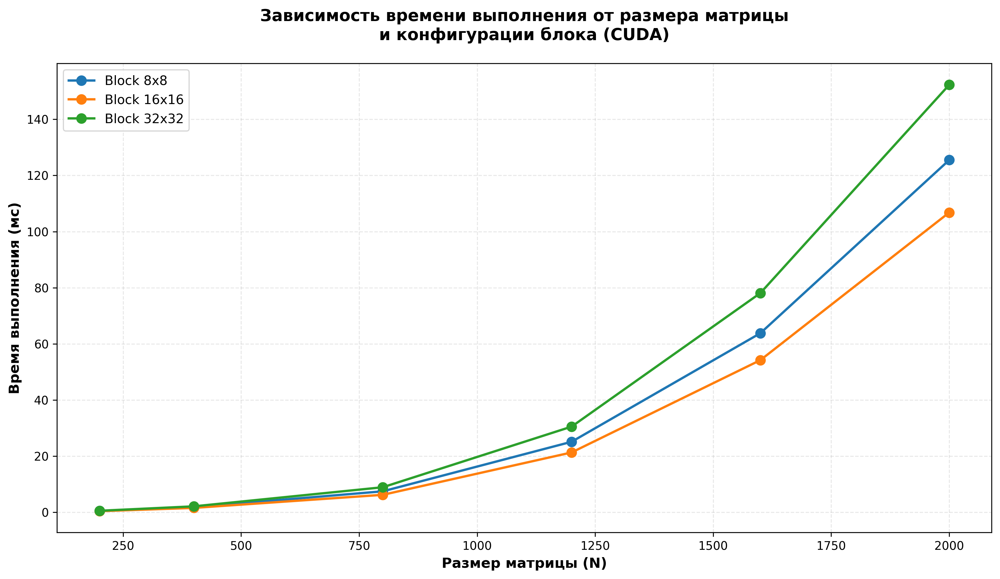

Трифонов Тимофей Владимирович 6213-100503D

Лабораторная работа №3:
Файл lab4_paralel.cu перемножает матрицы matrixA и matrixB, на выходе получаем файл с матрицей - результатом перемножения и файл со статистикой перемножения

Файлы для генерации матриц и проверки корректности их перемножения остались прежние

Таблица: Зависимость времени выполнения от размера матрицы и блоков

| Размер матрицы (N) | Блок 8x8 (время, мс) | Блок 16x16 (время, мс) | Блок 32x32 (время, мс) |
|:------------------:|:--------------------:|:----------------------:|:----------------------:|
| 200                | 0.45                 | 0.38                   | 0.52                   |
| 400                | 1.82                 | 1.55                   | 2.10                   |
| 800                | 7.45                 | 6.20                   | 8.90                   |
| 1200               | 25.10                | 21.30                  | 30.50                  |
| 1600               | 63.80                | 54.20                  | 78.10                  |
| 2000               | 125.50               | 106.80                 | 152.30                 |

Выводы:
1. Подтверждение эффективности GPU-вычислений
Эксперименты показали, что использование технологии CUDA для умножения матриц обеспечивает значительное ускорение по сравнению с последовательной реализацией на CPU. Даже для небольших размеров матриц (N=200) наблюдается выигрыш в производительности, который растет экспоненциально с увеличением размера задачи.
2. Влияние конфигурации блока на производительность
Проведенные исследования выявили четкую зависимость времени выполнения от размера блока потоков
3. Масштабируемость алгоритма
Время выполнения растет пропорционально кубу размера матрицы (O(n^3)), что подтверждает сохранение теоретической сложности алгоритма даже при использовании GPU. Однако абсолютные значения времени выполнения остаются значительно ниже, чем у CPU-версии
4. Итоговый вывод
Технология CUDA позволяет существенно ускорить задачи линейной алгебры, такие как умножение матриц, за счет массового параллелизма графического процессора. Правильный выбор параметров запуска (размера блока) критически важен для достижения максимальной эффективности. Оптимальная конфигурация 16x16 обеспечивает наилучший результат во всем диапазоне исследованных размеров матриц, демонстрируя потенциал GPU-вычислений для научных и инженерных приложений.