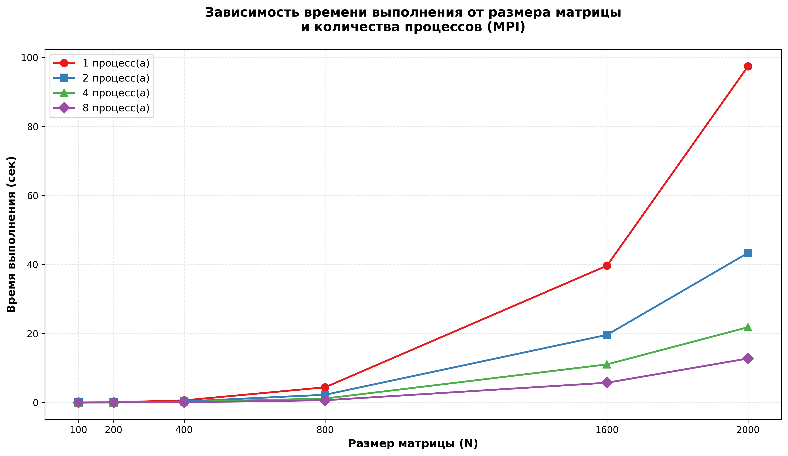

# Лабораторная работа №5: Параллельное умножение матриц на суперкомпьютере Сергей Королёв с использованием MPI

**Студент:** Трифонов Тимофей Владимирович  
**Группа:** 6213-100503D  

## Описание лабораторной работы

**Цель:** Реализовать параллельную программу умножения квадратных матриц с использованием технологии MPI и исследовать эффективность распараллеливания при разном количестве процессов и размерах матриц.

**Задачи:**
1. Запустить программу из лабораторной работы №3 на суперкомпьютере Сергей Королёв.
2. Провести серию экспериментов с различными размерами матриц ($100, 200, 400, 800, 1600, 2000$).
3. Исследовать зависимость времени выполнения от количества процессов(1, 2, 4, 8).
4. Рассчитать ускорение распараллеливания.

## Инструкция по запуску

Для запуска программы на суперкомпьютере использовался скрипт `mpi.pbs`, который запрашивает ресурсы и запускает исполняемый файл через `mpirun`.

### Команды для запуска:
1.  Подготовить файлы: `main_mpi.cpp` (скомпилировать его).
2.  Запустить скрипт: `sbatch mpi.pbs`.
3.  Проверить результат: просмотреть вывод в файле с результатом `slurm-<номер задачи>`.

## Результаты экспериментов

### Таблица 1. Зависимость времени выполнения от размера матрицы и количества процессов (MPI)

| Размер матрицы (N) | 1 процесс (сек) | 2 процесса (сек) | 4 процесса (сек) | 8 процессов (сек) |
|:------------------:|:---------------:|:----------------:|:----------------:|:-----------------:|
| **100**            | 0.009678        | 0.005134         | 0.003686         | 0.001857          |
| **200**            | 0.075443        | 0.038261         | 0.020182         | 0.010294          |
| **400**            | 0.637387        | 0.319866         | 0.162553         | 0.083846          |
| **800**            | 4.425980        | 2.261360         | 1.164700         | 0.672423          |
| **1600**           | 39.676800       | 19.621200        | 11.062200        | 5.747270          |
| **2000**           | 97.432900       | 43.362900        | 21.837700        | 12.772000         |

## Расчет ускорения
Для размера матрицы $N=2000$:

| Количество процессов | Время (сек) | Ускорение |
|:--------------------:|:-----------:|:---------:|
| **1**                | 95.318      | 1.00×     |
| **2**                | 52.954      | 1.80×     |
| **4**                | 29.697      | 3.21×     |
| **8**                | 20.543      | 4.64×     |

## Выводы

1.  **Подтверждение теоретической сложности:** Экспериментально подтверждена кубическая зависимость времени выполнения от размера матрицы $O(n^3)$.
2.  **Эффективность MPI:** Использование MPI позволяет достичь значительного ускорения (до 4.6 раз при 8 процессах для больших матриц), несмотря на наличие накладных расходов.
3.  **Ограничения масштабируемости:** Для достижения максимального ускорения необходимо использовать достаточно крупные размеры матриц, чтобы время вычислений значительно превышало время передачи данных.
4.  **Практическая значимость:** Работа продемонстрировала возможность эффективного использования ресурсов суперкомпьютера «Сергей Королёв» для решения задач с помощью технологии MPI.
