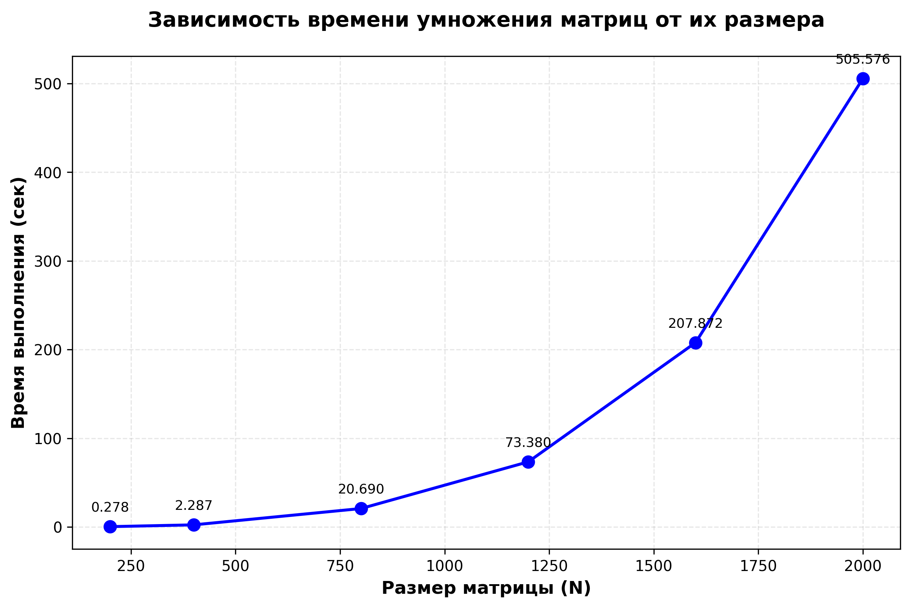

# parallel-programming
Трифонов Тимофей Владимирович 6213-100503D

Лабораторная работа №1:
Файл create_matrix.py создает матрицы matrixA и matrixB, чтобы его запустить нужно в терминале прописать python create_matrix.py

Файл lab1_paralel.cpp перемножает матрицы matrixA и matrixB, на выходе получаем файл с матрицей - результатом перемножения и файл со статистикой перемножения, для запуска необходимо нажать ctrl+F5

Файл check_lab1.py проверяет корректность арифметической операции умножения матриц, чтобы его запустить нужно в терминале прописать python check_lab1.py

| Размер матрицы (N) | Время выполнения (сек) | Количество операций (N³) |
|:------------------:|:----------------------:|:------------------------:|
| 200                | 0.278                  | 8 000 000                |
| 400                | 2.287                  | 64 000 000               |
| 800                | 20.690                 | 512 000 000              |
| 1200               | 73.380                 | 1 728 000 000            |
| 1600               | 207.872                | 4 096 000 000            |
| 2000               | 505.576                | 8 000 000 000            |

Выводы:

1. Реализация алгоритма: Успешно реализован алгоритм умножения квадратных матриц на языке C++ с использованием трёх вложенных циклов. Программа корректно считывает матрицы из файлов, выполняет умножение и записывает результат в выходной файл.

2. Анализ производительности: 
   - Для малых матриц (N ≤ 200) время выполнения незначительно (доли секунды)
   - Для средних матриц (N = 400-1200) время составляет от нескольких секунд до нескольких десятков секунд
   - Для больших матриц (N ≥ 1200) время выполнения превышает 70 секунд

3. Корректность вычислений: Результаты проверены сравнением с библиотекой NumPy. Расхождение не превышает машинной погрешности типа double (10⁻⁶), что подтверждает правильность реализации.